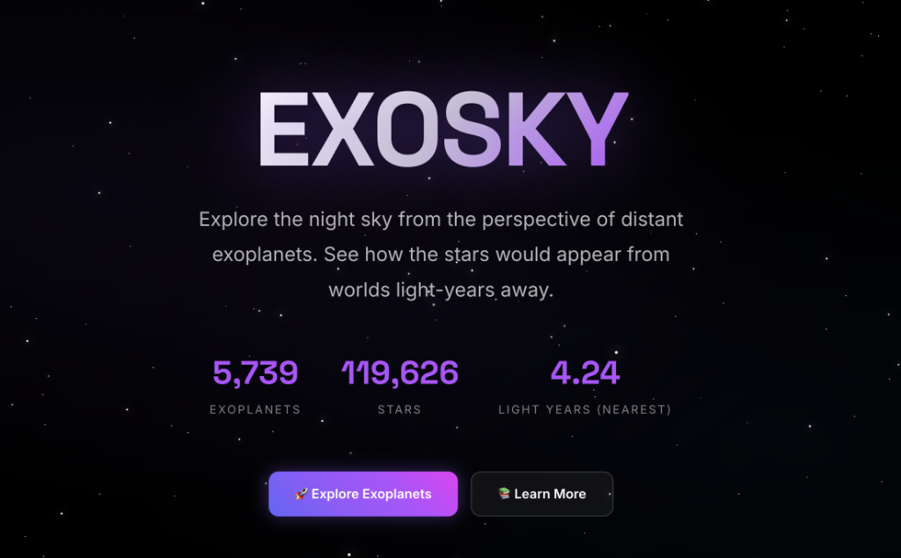
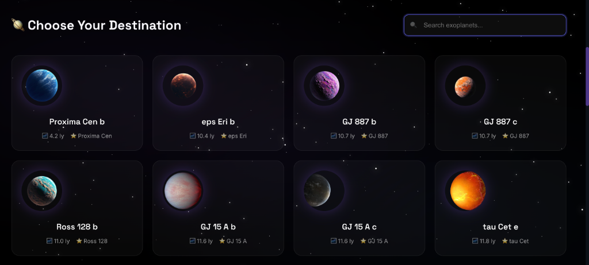
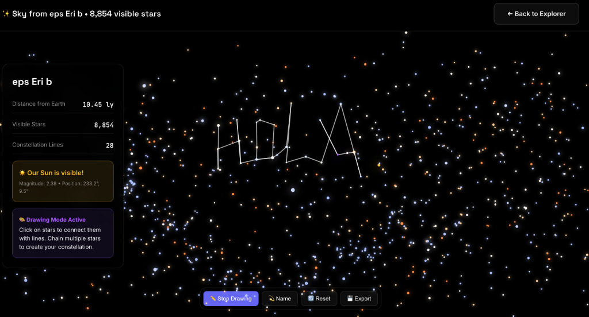

# 🌌 EXOSKY - NASA Space Apps Challenge 2024

**EXOSKY** es una plataforma interactiva diseñada para visualizar el cielo nocturno desde la perspectiva de miles de exoplanetas conocidos. Este proyecto fue desarrollado para el **NASA Space Apps Challenge 2024**, combinando datos científicos reales con una interfaz moderna y atractiva.



## ✨ Características Principales

- **Exploración de Exoplanetas**: Accede a un catálogo de más de **5,700 exoplanetas** con datos de distancia, masa y estrella anfitriona.
- **Visualización Estelar Real**: Renderizado del cielo nocturno utilizando el catálogo **HYG v4.1** con más de **119,000 estrellas**, ajustando el brillo y la posición según la ubicación del exoplaneta elegido.
- **Constelaciones Interactivas**: Herramienta de dibujo para que los usuarios creen y nombren sus propias constelaciones sobre el mapa estelar dinámico.
- **Búsqueda Avanzada**: Encuentra destinos específicos por nombre o explora los planetas más cercanos a la Tierra.
- **Diseño Premium**: Interfaz oscura optimizada para la observación astronómica, construida con React y Tailwind CSS.



## 🚀 Tutorial de Ejecución

Sigue estos pasos para ejecutar la aplicación de forma local en tu máquina.

### 1. Requisitos Previos

- **Python 3.10+**
- **Node.js (v18+)** y **npm**
- **Git**

### 2. Clonar el Repositorio

```bash
git clone https://github.com/tu-usuario/Exosky-Nasa-Space-App-2024.git
cd Exosky-Nasa-Space-App-2024
```

### 3. Ejecutar el Backend (FastAPI)

El backend maneja los cálculos astronómicos y sirve los catálogos en formato CSV.

```bash
cd backend
# Activar el entorno virtual (si ya existe)
source venv/bin/activate
# Instalar dependencias
pip install -r requirements.txt
# Iniciar el servidor
python app.py
```
*El backend estará disponible en `http://localhost:8000`.*

### 4. Ejecutar el Frontend (React)

El frontend proporciona la interfaz de usuario interactiva.

```bash
cd ../react_app
# Instalar dependencias
npm install
# Configurar variables de entorno
# Asegúrate de que .env tenga: REACT_APP_API_URL=http://localhost:8000
npm start
```
*La aplicación se abrirá automáticamente en `http://localhost:3000`.*



## 🛠️ Tecnologías Utilizadas

- **Frontend**: React.js, Tailwind CSS, React Sketch Canvas (para constelaciones).
- **Backend**: FastAPI (Python), Pandas, NumPy (para procesamiento de datos masivos).
- **Datos**: Catálogo de Exoplanetas de la NASA, Catálogo Estelar HYG.

---

